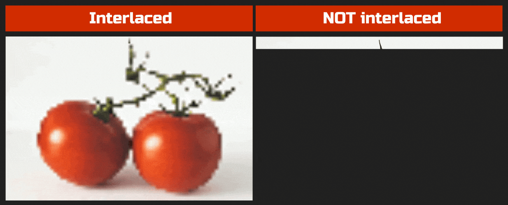
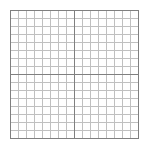
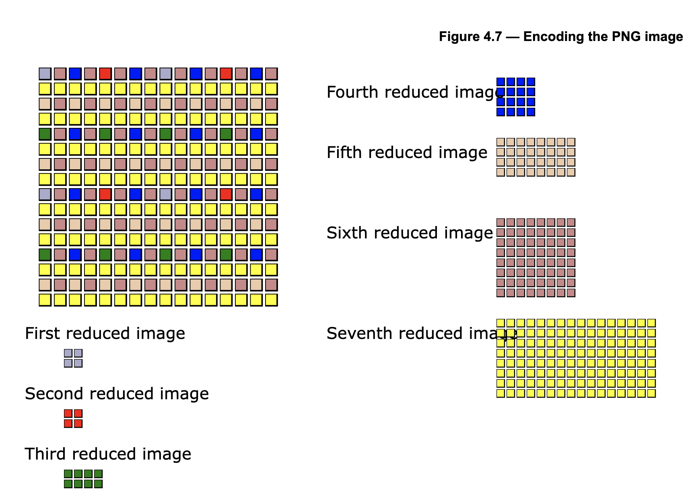

# `png-rs`

The main goal of `png-rs` is to:
1. efficiently decode PNG chunks on web/desktop/any other wasm standalone environments using Webassembly and Rust
2. walk anyone through decoding a PNG in Rust as easily as possible. This is because I found nowhere that has some comprehensive tutorial about building a PNG decoder by oneself.

_Disclaimer: BTW this is my first project using Rust, so the code must be very awful. Any help is appreciated._

## Table of Contents

1. [`png-rs`](#`png-rs`)
    1. [Table of Contents](#table-of-contents)
    1. [How (and why) it works](#how-(and-why)-it-works)
    1. [Developing](#developing)
        1. [Cli](#cli)
        1. [WASM](#wasm)
        1. [Testing](#testing)
1. [How it works](#how-it-works)
1. [What is PNG?](#what-is-png?)
1. [Chunks](#chunks)
    1. [Critical and ancillary chunks](#critical-and-ancillary-chunks)
    1. [PLTE chunk](#plte-chunk)
    1. [IHDR chunk](#ihdr-chunk)
    1. [IDAT chunk](#idat-chunk)
        1. [Decoding IDAT](#decoding-idat)
            1. [Read & decompress](#read-&-decompress)
            1. [zlib stream & buffer](#zlib-stream-&-buffer)
            1. [Unfilter](#unfilter)
            1. [De-interlace](#de-interlace)
            1. [Bitmapping the unfiltered data](#bitmapping-the-unfiltered-data)
            1. [Multi-sample pixels with 8 and 16-bit samples](#multi-sample-pixels-with-8-and-16-bit-samples)
    1. [IEND chunk](#iend-chunk)
    1. [CRC (cyclic redundancy checks)](#crc-(cyclic-redundancy-checks))
    1. [Error handling](#error-handling)
1. [Benchmarks](#benchmarks)
1. [References I used](#references-i-used)

## How (and why) it works
`png-rs` adopts Rust as the default language. This enables us to produce the code in both Rust and Wasm.

Then, since wasm can be used on browsers and Node.js, `png-rs` can be used on these javascript environments.

Also, since wasm can additionally be used as standalone executable (sort of) with `wasmtime`, it can basically be used for any wasm standalone environments: i.e. anywhere `wasmtime` can run. `wasmtime` also supports embedding wasm into other languages like GoLang or Python. So that's the case for `png-rs` and any Rust based applications as well.

And of course, because it's written in Rust, a classic binary executable can also be produced. It might be interesting to see how a running binary executable and wasm standalone file are different in terms of speed or efficiency (let me know if there is any info/obvious answer for that already).

So, in summary, `png-rs` can be used in/for:
- browsers
- node.js
- other languages that support embedding wasm files through `wasmtime`
- standalone wasm environments
- building a classic executable that runs on major operating systems

## Developing
### Cli
```
# test decoding an image. while you could also test it using wasm, using the cli package will be the easiest way to do it
cargo run -p cli -- --input test/png/samples/3.png

# or just run test over all images (takes about a sec)
cargo test
```

### WASM

Build the wasm binary manually:
```bash
chmod u+x build-nodejs.sh

./build-nodejs.sh

node index.js
```

Build the binary and run the test:
```bash
npm test
```

### Testing
`png-rs` uses the official png testsuite, [PngSuite](https://www.schaik.com/pngsuite/#), along with select pngs provided by myself. Snapshot testing is WIP and contributions are welcome.
# How it works

# What is PNG?
- PNG stands for Portable Network Graphics.
- It supports loseless data compression.
- It has multiple chunks containing info about the graphics.
  - some chunks are critical (necessary) and others ancillary.

# Chunks
Every PNG has chunks. Every chunk has the same structure: 
- 4 bytes of length: length of the chunk data.
- 4 bytes of chunk type: there are multiple kinds of chunks, which are to be explained below
- 0~2^31-1 bytes of chunk data: contains useful info. for example, image data.
- 4 bytes of cyclic redundancy check value (CRC): derived from chunk type + chunk data bytes. To be explained in greater detail later in this document too.

## Critical and ancillary chunks
Critical chunks types are PLTE, IDAT, IHDR, and IEND. Any other types are ancillary. Critical chunks must appear (except PLTE, under certain conditions). Ancillary chunks may or may not appear.

## PLTE chunk
The PLTE chunk contains from 1 to 256 palette entries. But what is a palette?

Each palette a three-byte series of the form:
   Red:   1 byte (0 = black, 255 = red)
   Green: 1 byte (0 = black, 255 = green)
   Blue:  1 byte (0 = black, 255 = blue)

It is a lookup table where only selected colors exist to reduce data usage in all contexts. The bit depth of 8 bits is the most prevalent in RGB color model, which assigns 8 bits per R, G, and B, totalling 24 bits. The aim of the palette, therefore, is to only store colors relevant to an image. Imagine if your image only contains a few colors close to red and white. Then, instead of storing and finding your color from the palette of all possible combinations, you will do it with your own reduced palette, which is more efficient.

## IHDR chunk
 
This chunk contains important metadata about the image. The data field should contain:
- Width:              4 bytes
- Height:             4 bytes
- Bit depth:          1 byte
- Color type:         1 byte
- Compression method: 1 byte (must be 0)
- Filter method:      1 byte (0 or 1)
- Interlace method:   1 byte (0 or 1)

Here is some elaboration on above values:
- **Width** and **height** are the dimensions of an image in pixels.
- **Bit depth** is a single-byte integer giving the number of bits per sample or per palette index (not per pixel). In easier terms, **it is the number of bits to represent a color of a single pixel**. Valid values are 1, 2, 4, 8, and 16, although not all values are allowed for all color types. This is also known as **color depth**. We know 1 bit can represent a binary thing. So 1 bit can represent two colors only. 2 bits, 2^2 colors. 3 bits, 2^3 colors, and so on.
- **Color type** is a single-byte integer that describes the interpretation of the image data. Color type codes represent sums of the following values: 1 (palette used), 2 (color used), and 4 (alpha channel used). Valid values are 0, 2, 3, 4, and 6.
- **Compression method** has always been 0 for more than 20 years since the advent of PNG. 0 specifies the compression method as deflate/inflate compression.
- We are going to discuss **filter method** and **interlace method** in a greater detail later.

Again, there is a set of rules for this chunk. [Please refer to the errors related](#wip).

## IDAT chunk
This contains the actual image data. Probably this usually be the chunk that is the most common among different types of chunks.

### Decoding IDAT
To decode IDAT, you need to:
1. Read IDAT chunks (because the series of IDAT chunks is a single zlib stream, broken up into pieces)
2. Decompress the data using the decompression method specified by the IHDR chunk.
3. Unfilter the filter applied to each row of image
4. De-interlace the data
5. Turn the data into a bitmap

#### Read & decompress

Because it's hard to imagine it first and put it into code, let's look at a simple example using 1x1 pixel png. It's located at `./src/images/png/tiny.png`.

If you try to iterate the chunks, you will find that this image only has a single IDAT chunk:

```
chunk data length 13
chunk type "IDAT"
compression method: 8
additional flags/check bits: 29
chunk data [8, 29, 99, 16, 21, 23, 253, 15, 0, 1, 199, 1, 65]
chunk crc [52, 145, 113, 115]
```

There is only one zlib header in the first IDAT chunk. So it has it there, 2 the first bytes in the chunk data (`8` and `29`)

[The following](https://stackoverflow.com/a/54915442) lists all possible headers:
```
      FLEVEL: 0       1       2       3
CINFO:
     0      08 1D   08 5B   08 99   08 D7
     1      18 19   18 57   18 95   18 D3
     2      28 15   28 53   28 91   28 CF
     3      38 11   38 4F   38 8D   38 CB
     4      48 0D   48 4B   48 89   48 C7
     5      58 09   58 47   58 85   58 C3
     6      68 05   68 43   68 81   68 DE
     7      78 01   78 5E   78 9C   78 DA
```
In the current example, it is `08 1D`, which is when `FLEVEL == 0 && CINFO == 0`. Obviously, you will find different headers across different images.

Let's now try to decompress it:

```rs
use miniz_oxide::inflate::{decompress_to_vec_zlib};

...
let raw_pixel_data: [u8; 13] = [8, 29, 99, 16, 21, 23, 253, 15, 0, 1, 199, 1, 65]
let decompressed = decompress_to_vec_zlib(&raw_pixel_data);
println!("decompressed: {:?}", decompressed) // decompressed: Ok([0, 21, 23, 21, 255])
```

Notice that now the image data has been decompressed and gave a result of `[0, 21, 23, 21, 255]`.

Again, remember that the zlib header appears only for the first time; so make a flag about whether you saw a IDAT chunk and if you have, regard the entire chunk data (except CRC bytes at the end) as real image data. You are still going to use zlib headers when decompressing the data, so include them in the raw image data.

```rs
  ChunkTypes::IDAT => {
    if !self.has_idat {
      self.compression_method = Some(chunk_data[0]);
      self.additional_flag_after_compression_method = Some(chunk_data[1]);
    } 
    self.raw_image_data.extend_from_slice(&chunk_data);
    
    ...
    
    if !self.has_idat {
      self.has_idat = true
    }
  }
```

Now let's confirm that it indeed works for larger images, with multiple IDAT chunks. Pick any of `./src/images/png/([0-9]*).png`. For this example, I chose `1.png`. It seems that it has multiple IDAT chunks:

```
chunk data length 13
chunk type "IHDR"
chunk crc [21, 92, 143, 170]
0
chunk data length 3173
chunk type "iCCP"
warning: unknown type iCCP
chunk crc [190, 17, 86, 109]
0
chunk data length 138
chunk type "eXIf"
warning: unknown type eXIf
chunk crc [185, 228, 246, 123]
0
chunk data length 9
chunk type "pHYs"
warning: unknown type pHYs
chunk crc [73, 82, 36, 240]
0
chunk data length 470
chunk type "iTXt"
warning: unknown type iTXt
chunk crc [117, 219, 251, 12]
0
chunk data length 28
chunk type "iDOT"
warning: unknown type iDOT
chunk crc [132, 206, 209, 143]
0
chunk data length 16384
chunk type "IDAT"
compression_method: 120
additional_flag_after_compression_method: 1
chunk crc [40, 229, 220, 56]
0
chunk data length 7829
chunk type "IDAT"
chunk crc [189, 221, 230, 117]
0
chunk data length 16384
chunk type "IDAT"
chunk crc [160, 118, 251, 55]
0
chunk data length 16384
chunk type "IDAT"
chunk crc [197, 145, 228, 212]
0
chunk data length 3809
chunk type "IDAT"
chunk crc [220, 38, 204, 83]
0
chunk data length 0
chunk type "IEND"
```

Because there are too many pixels for this example, let's look at the first 100 bytes only:

```rs
println!("raw_pixel_data: {:?}", &self.raw_pixel_data[..100]);
let decompressed = decompress_to_vec(&self.raw_pixel_data);

match decompressed {
  Ok(d) => println!("Okie: {:?}", &d[..100]),
  Err(err) => println!("Something wrong: {:?}", err)
}
```

And it gives:
```
raw_pixel_data: [236, 157, 5, 124, 30, 69, 250, 199, 159, 184, 75, 147, 54, 77, 155, 52, 169, 27, 165, 208, 98, 117, 172, 180, 197, 221, 14, 40, 238, 199, 161, 7, 119, 135, 59, 199, 255, 176, 227, 14, 45, 86, 224, 176, 187, 226, 69, 90, 168, 81, 7, 90, 234, 238, 150, 38, 109, 220, 237, 63, 207, 27, 118, 179, 239, 100, 237, 213, 188, 239, 230, 55, 124, 202, 238, 206, 142, 126, 39, 239, 238, 111, 103, 158, 153, 137, 160, 67, 142, 110, 166, 16, 114, 159, 63, 150, 238, 42, 205, 251]
Okie: [1, 0, 43, 54, 255, 0, 0, 0, 0, 0, 0, 0, 0, 0, 0, 0, 0, 0, 0, 0, 0, 0, 0, 0, 0, 0, 0, 0, 0, 0, 0, 0, 0, 0, 0, 0, 0, 0, 0, 0, 0, 0, 0, 0, 0, 0, 0, 0, 0, 0, 0, 0, 0, 0, 0, 0, 0, 0, 0, 0, 0, 0, 0, 0, 0, 0, 0, 0, 0, 0, 0, 0, 0, 0, 0, 0, 0, 0, 0, 0, 0, 0, 0, 0, 0, 0, 0, 0, 0, 0, 0, 0, 0, 0, 0, 0, 0, 0, 0, 0]
```

#### zlib stream & buffer

Now, we obviously don't want to load all of the data from the image at once and process it at once, because that is potentially going to overload the memory. Instead, what we can do is to create a buffer and corresponding stream to work with it. In that way, the data will be decoded as it comes in.

There are several Rust libraries for zlib out there. Among them is [miniz_oxide](https://github.com/Frommi/miniz_oxide/tree/master/miniz_oxide). Using it will be sufficient for our purpose. zlib stream is already implemented by `use miniz_oxide::inflate::core::{decompress}`. All we have to do is use it:

```rs
    fn decode_idat_chunk(&mut self, chunk: &Vec<u8>) {
        if !self.has_idat {
            self.compression_method = Some(chunk[0]);
            self.additional_flag_after_compression_method = Some(chunk[1]);
        }
        self.zlib_decompress_stream.decompress(&chunk);
        if !self.has_idat {
            self.has_idat = true
        }
    }

  // in zlib_decompress_stream.rs
  
  ...

   pub fn decompress(&mut self, raw_image_bytes: &Vec<u8>) {
        let mut in_buffer_byte_pos = 0;
        while in_buffer_byte_pos < raw_image_bytes.len() {
            self.resize_out_buffer_if_needed();
            let (TINFL_status, num_bytes_read, num_bytes_written) = decompress(
                &mut self.decompressor_state,
                &raw_image_bytes[in_buffer_byte_pos..],
                &mut self.out_buffer[..],
                self.out_buffer_byte_pos,
                BASE_FLAGS,
            );

            in_buffer_byte_pos += num_bytes_read;
            self.out_buffer_byte_pos += num_bytes_written;
        }
    }
```

The `decompress` implementation is very minimal and needs a lot more substance, which will be modified as the library develops. For now, it does the job; it can just serve the purpose of writing to the output buffer by decompressing small continuous parts. For the current state of code for zlib decompress stream, [please directly refer to the file](https://github.com/9oelM/png-rs/blob/master/core/src/zlib.rs). 

#### Unfilter

So it seems like it's working, right? Now you have a raw but unfiltered PNG bitmap. As of now (and probably for the next decades), the filter method is always `0` because there's only one filter method called adaptive filtering, and interlace method is either `0` or `1`, `0` meaning there is no interlace applied thus no de-interlace is needed, and `1` meaning the data is interlaced and thus needs to be de-interlaced. These two bytes are obtained from the IHDR chunk.

But what is filter and interacing in the first place? The filter is used to optimize an image. There are [5 different line filters](http://www.libpng.org/pub/png/spec/1.2/PNG-Filters.html) based on the spec:
```
Type    Name

0       None
1       Sub
2       Up
3       Average
4       Paeth
```

The first filter leaves the original data intact, and the other four are subtracting from each pixel a value that involves the neighbor pixels from the left, up, and/or the upper left. 

For example, a 'left' filter would transform a sequence of `2, 3, 4, 5, 6, 7, 8, 9` to `2, 1, 1, 1, 1, 1, 1, 1`. As described by the libpng docs, it is a 'precompression step' because it transforms the data so that it can be compressed more efficiently. 

Here is [more in-depth look at what each filter does](http://www.libpng.org/pub/png/book/chapter09.html#png.ch09.tbl.1):

|  Name     | Description                                                                                                                                               |
|-----------|-----------------------------------------------------------------------------------------------------------------------------------------------------------|
|  None     | Each byte is unchanged.                                                                                                                                   |
|  Sub      | Each byte is replaced with the difference between it and the 'corresponding byte' to its left.                                                          |
|  Up       | Each byte is replaced with the difference between it and the byte above it (in the previous row, as it was before filtering).                             |
|  Average  | Each byte is replaced with the difference between it and the average of the corresponding bytes to its left and above it, truncating any fractional part. |
|  Paeth    | Each byte is replaced with the difference between it and the Paeth predictor of the corresponding bytes to its left, above it, and to its upper left.     |

You don't have to understand the Paeth filter. It's just another way of compressing things, and you just need to adopt and reverse [the pseudocode for it from the docs](http://www.libpng.org/pub/png/spec/1.2/PNG-Filters.html) because it is 'un'filtering.

The bytes that came out of decompression using zlib are directly fed into unfilter. It is crucial to note that **each scanline starts with the filter type bit**. But before that, let's talk about scanline. A length of a scanline is simply the pixel width of the image in bytes, because one pixel does not necessarily equates to one byte. To calculate that, we need `bytes_per_pixel`: which is  `(channel * bit_depth) / 8`, where `channel` is determined by `color_type` from IHDR chunk and `bit_depth` is obtained from the IHDR chunk too. So here's the pseudocode:

```
let (color_type, bit_depth, image_width_in_pixels): (u8, u8, usize) = get_colortype_and_bit_depth_from_ihdr();
let channel: u8 = colortype_to_channel(color_type);
let bytes_per_pixel: usize = (channel * bit_depth) as usize / 8;
let scanline_width: usize = bytes_per_pixel * image_width_in_pixels;
```

Now, back to the filter type byte. Each filter type (None, Sub, Up, Avg, Paeth) is specified by 0, 1, 2, 3, 4. So at the start of the scanline, you would want to do something like this:

```rs
while !are_all_scanlines_read {
    // somehow loop each scanline ...
    let current_scanline = read_somehow()
    let filter_type: u8 = current_scanline[0];

    match filter_type {
        0 => filter_none(...)
        1 => filter_sub(...)
        2 => filter_up(...)
        3 => filter_avg(...)
        4 => filter_paeth(...)
    }
}
```

Right. And I will just explain three of the filter methods, None, Sub and Up because you will get to see how it works as you read through anyway. Avg and Paeth work the similar way - just a different algorithm. Explanations are embedded as comments.

```rs
pub struct Unfilter {
  ...
  /// unfiltered output. the unfiltered data will be written to here
  out_buffer: Vec<u8>,
}

impl Unfilter {
  ...

  
    /// Filter type 0. Basically does nothing other than copying the decompressed output from zlib to the output buffer.
    fn unfilter_none(
        &mut self,
        out_buffer_start_index: usize,
        in_buffer_start_index: usize,
        in_buffer: &Vec<u8>,
    ) {
        for i in 0..self.bytes_per_line {
            self.out_buffer[out_buffer_start_index + i] = in_buffer[in_buffer_start_index + i];
        }
    }
    /// Filter type 1. The first pixel bytes in the scanline are just copied over to the output buffer, just like filter type 0.
    /// For the following bytes after the first pixel bytes, the byte immediately left by one pixel is added to the position of the filtered data.
    /// For example, if:
    /// ```
    /// out_buffer_start_index = 5
    /// bytes_per_pixel = 2
    /// 
    /// current_scanline (not yet unfiltered) =
    /// index:  0 1 2 3 4 5 6 7 8 ...
    ///     -------------------------------
    ///     ...|5|5|5|4|3|2|5|6|7|8|5|2|5|
    ///     -------------------------------
    /// 
    /// unfiltered_output = 
    /// index:  0 1 2 3 4 5 6 7 8 ...
    ///     -------------------------------
    ///     ...|5|5|5|4|3| | | | | | | | |
    /// ```
    /// 
    /// then
    /// 
    /// ```
    /// unfiltered_output = current_scanline[5] + unfiltered_output[5-2]
    /// = 2 + 4
    /// ```
    /// Also, note that unsigned arithmetic modulo 256 is used, 
    /// so that both the inputs and outputs fit into bytes.
    /// this is just another way of saying if you have an overflow in `u8`, you will wrap it around with (a + b) % 256 (`.wrapping_add` in the code), so that you always stay in that 8 bits.
    ///  
    fn unfilter_sub(
        &mut self,
        out_buffer_start_index: usize,
        in_buffer_start_index: usize,
        in_buffer: &Vec<u8>,
    ) {
        // first, handle bytes corresponding to the first pixel
        let (out_buffer_start_index, in_buffer_start_index) = self
            .copy_first_pixel_bytes_in_current_line(
                out_buffer_start_index,
                in_buffer_start_index,
                in_buffer,
            );

        // next, handle the rest of the bytes in the scanline
        for i in 0..self.bytes_per_line - self.bytes_per_pixel {
            let out_buffer_immediate_pixel_left_index =
                out_buffer_start_index + i - self.bytes_per_pixel;
            self.out_buffer[out_buffer_start_index + i] = in_buffer[in_buffer_start_index + i]
                .wrapping_add(self.out_buffer[out_buffer_immediate_pixel_left_index]);
        }
    }

    /// Filter type 2. 
    /// 
    /// If it is the first scanline, simply copy each byte over. If not, apply the below pseudocode.
    /// ```
    /// unfiltered_output[i] = 
    ///     (current_scanline[i] + 
    ///     // the byte that was unfiltered already, directly above the current byte's  
    ///     unfiltered_output[i - bytes_per_line]) 
    ///     // modulo 256
    ///     % 256;
    /// ```
    fn unfilter_up(
        &mut self,
        out_buffer_start_index: usize,
        in_buffer_start_index: usize,
        in_buffer: &Vec<u8>,
    ) {
        // first scanline
        if out_buffer_start_index == 0 {
            self.unfilter_none(
                out_buffer_start_index,
                in_buffer_start_index,
                in_buffer,
            );
            return;
        }
        // following scanlines
        for i in 0..self.bytes_per_line {
            self.out_buffer[out_buffer_start_index + i] = in_buffer[in_buffer_start_index]
                .wrapping_add(self.out_buffer[out_buffer_start_index + i - self.bytes_per_line]);
        }
    }

    ...


    /// unfilters scanlines with possibly varying filter types.
    /// * `in_buffer` - the bytes decompressed by zlib
    pub fn unfilter(&mut self, in_buffer: &Vec<u8>) -> &Vec<u8> {
        let mut filter_byte_index: usize = 0;
        for line_number in 0..self.height.try_into().expect("Height doesn't fit in usize") {
            // An additional "filter type" byte is added to the beginning of every scanline (see Filtering). The filter type byte is not considered part of the image data, but it is included in the datastream sent to the compression step.
            let filter_type = in_buffer[filter_byte_index];
            let out_buffer_start_index = self.get_out_buffer_index(line_number, 0);
            let in_buffer_start_index = filter_byte_index + 1;

            match filter_type {
                0 => self.unfilter_none(
                    out_buffer_start_index,
                    in_buffer_start_index,
                    in_buffer,
                ),
                1 => self.unfilter_sub(
                    out_buffer_start_index,
                    in_buffer_start_index,
                    in_buffer,
                ),
                2 => self.unfilter_up(
                    out_buffer_start_index,
                    in_buffer_start_index,
                    in_buffer,
                ),
                3 => self.unfilter_avg(
                    out_buffer_start_index,
                    in_buffer_start_index,
                    in_buffer,
                ),
                4 => self.unfilter_paeth(
                    out_buffer_start_index,
                    in_buffer_start_index,
                    in_buffer
                ),
                _ => panic!(
                    "Unknown filter type: {:?}",
                    filter_type
                ),
            }
            filter_byte_index += self.bytes_per_line + 1;
        }
        return &self.out_buffer;
    }
}
```

#### De-interlace

Now, interlacing. There is only one interlace method: Adam7 interlace (represented by 1). No interlace method equals 0. Interlacing is just designed for progressive loading/display. [Seeing it](./https://www.imghaste.com/blog/progressive-interlaced-images) will help understand faster:



And here's Adam7 interlace method in GIF (8x8 pattern replicated 4 times across the image):



You kinda get it, right? Instead of loading the image from the very top to the bottom, You load them evenly across the image, so that users can recognize the image earlier.



The original image is divided into 7 separate reduced images. The first image will be very small compared to the last one; the pixels will come from the image evenly: first pixel from the left top, next one from the middle top, and next from middle left, and next one from the centre. Next image will contain pixels spread across the original image likewise, and so on.

The data decompressed by zlib is just a single, straight buffer. So we will pretend that this buffer is divided into 7 parts, the first part corresponding to the first reduced image, and second for the second, and so on.

This is an example of metadata of reduced images for a [32x32 pixels image from PngSuite](./test/png/official/basi0g01.png):

```
[
    ReducedImage { pixel_width: 4, pixel_height: 4, bytes_per_line: 1, bytes_per_pixel: 1 },
    ReducedImage { pixel_width: 4, pixel_height: 4, bytes_per_line: 1, bytes_per_pixel: 1 }, 
    ReducedImage { pixel_width: 8, pixel_height: 4, bytes_per_line: 1, bytes_per_pixel: 1 },
    ReducedImage { pixel_width: 8, pixel_height: 8, bytes_per_line: 1, bytes_per_pixel: 1 },
    ReducedImage { pixel_width: 16, pixel_height: 8, bytes_per_line: 2, bytes_per_pixel: 1 },
    ReducedImage { pixel_width: 16, pixel_height: 16, bytes_per_line: 2, bytes_per_pixel: 1 },
    ReducedImage { pixel_width: 32, pixel_height: 16, bytes_per_line: 4, bytes_per_pixel: 1 }
]
```

And this is how we get above information:

```rs
pub fn create_reduced_images(pixel_width: u32, pixel_height: u32, channel: u8, bit_depth: u8) -> [ReducedImage; 7] {
    let mut reduced_images: [ReducedImage; 7] = [ReducedImage::default(); 7];

    for pass in 1..=7 {
        let (pixel_width, pixel_height) = match pass {
            1 => {
                let pass_width = (pixel_width + 7) >> 3;
                let pass_height = (pixel_height + 7) >> 3;
                (pass_width, pass_height)
            }
            2 => {
                let pass_width = (pixel_width >> 3) + ((pixel_width & 7) / 5);
                let pass_height = (pixel_height + 7) >> 3;
                (pass_width, pass_height)
            }
            3 => {
                let pass_width = ((pixel_width >> 3) << 1) + (((pixel_width & 7) + 3) >> 2);
                let pass_height = (pixel_height >> 3) + ((pixel_height & 7) / 5);
                (pass_width, pass_height)
            }
            4 => {
                let pass_width = ((pixel_width >> 3) << 1) + (((pixel_width & 7) + 1) >> 2);
                let pass_height = (pixel_height + 3) >> 2;
                (pass_width, pass_height)
            }
            5 => {
                let pass_width = (pixel_width >> 1) + (pixel_width & 1);
                let pass_height = ((pixel_height >> 3) << 1) + (((pixel_height & 7) + 1) >> 2);
                (pass_width, pass_height)
            }
            6 => {
                let pass_width = pixel_width >> 1;
                let pass_height = (pixel_height >> 1) + (pixel_height & 1);
                (pass_width, pass_height)
            }
            7 => {
                let pass_width = pixel_width;
                let pass_height = pixel_height >> 1;
                (pass_width, pass_height)
            }
            _ => (0, 0),
        };
        let (bytes_per_pixel, bytes_per_line) = common::calc_bytes_per_pixel_and_line(
            channel,
            bit_depth,
            pixel_width,
        );
        reduced_images[pass - 1] = ReducedImage {
            pixel_width,
            pixel_height,
            bytes_per_pixel,
            bytes_per_line,
        };
    }

    return reduced_images;
}
```

I will elaborate on the code above. It basically replicates this pattern over the original image. Each number represents the pixel belonging to nth 'pass' or 'reduced image'.

```
1 6 4 6 2 6 4 6
7 7 7 7 7 7 7 7
5 6 5 6 5 6 5 6
7 7 7 7 7 7 7 7
3 6 4 6 3 6 4 6
7 7 7 7 7 7 7 7
5 6 5 6 5 6 5 6
7 7 7 7 7 7 7 7
```

Just to help understand - if we replicate this pattern over the entire image, it will be like this:

```
1 6 4 6 2 6 4 6 1 6 4 6 2 6 4 6 1 6 4 6 2 6 4 6 1 6 4 6 2 6 4 6  ... continues ...
7 7 7 7 7 7 7 7 7 7 7 7 7 7 7 7 7 7 7 7 7 7 7 7 7 7 7 7 7 7 7 7  
5 6 5 6 5 6 5 6 5 6 5 6 5 6 5 6 5 6 5 6 5 6 5 6 5 6 5 6 5 6 5 6
7 7 7 7 7 7 7 7 7 7 7 7 7 7 7 7 7 7 7 7 7 7 7 7 7 7 7 7 7 7 7 7
3 6 4 6 3 6 4 6 3 6 4 6 3 6 4 6 3 6 4 6 3 6 4 6 3 6 4 6 3 6 4 6
7 7 7 7 7 7 7 7 7 7 7 7 7 7 7 7 7 7 7 7 7 7 7 7 7 7 7 7 7 7 7 7
5 6 5 6 5 6 5 6 5 6 5 6 5 6 5 6 5 6 5 6 5 6 5 6 5 6 5 6 5 6 5 6
7 7 7 7 7 7 7 7 7 7 7 7 7 7 7 7 7 7 7 7 7 7 7 7 7 7 7 7 7 7 7 7
1 6 4 6 2 6 4 6 1 6 4 6 2 6 4 6 3 6 4 6 3 6 4 6 3 6 4 6 3 6 4 6
7 7 7 7 7 7 7 7 7 7 7 7 7 7 7 7 7 7 7 7 7 7 7 7 7 7 7 7 7 7 7 7
5 6 5 6 5 6 5 6 5 6 5 6 5 6 5 6 5 6 5 6 5 6 5 6 5 6 5 6 5 6 5 6
7 7 7 7 7 7 7 7 7 7 7 7 7 7 7 7 7 7 7 7 7 7 7 7 7 7 7 7 7 7 7 7
3 6 4 6 3 6 4 6 3 6 4 6 3 6 4 6 3 6 4 6 3 6 4 6 3 6 4 6 3 6 4 6  ... continues ...
7 7 7 7 7 7 7 7 7 7 7 7 7 7 7 7 7 7 7 7 7 7 7 7 7 7 7 7 7 7 7 7
5 6 5 6 5 6 5 6 5 6 5 6 5 6 5 6 5 6 5 6 5 6 5 6 5 6 5 6 5 6 5 6
7 7 7 7 7 7 7 7 7 7 7 7 7 7 7 7 7 7 7 7 7 7 7 7 7 7 7 7 7 7 7 7
1 6 4 6 2 6 4 6 1 6 4 6 2 6 4 6 3 6 4 6 3 6 4 6 3 6 4 6 3 6 4 6
7 7 7 7 7 7 7 7 7 7 7 7 7 7 7 7 7 7 7 7 7 7 7 7 7 7 7 7 7 7 7 7
5 6 5 6 5 6 5 6 5 6 5 6 5 6 5 6 5 6 5 6 5 6 5 6 5 6 5 6 5 6 5 6
7 7 7 7 7 7 7 7 7 7 7 7 7 7 7 7 7 7 7 7 7 7 7 7 7 7 7 7 7 7 7 7
3 6 4 6 3 6 4 6 3 6 4 6 3 6 4 6 3 6 4 6 3 6 4 6 3 6 4 6 3 6 4 6
7 7 7 7 7 7 7 7 7 7 7 7 7 7 7 7 7 7 7 7 7 7 7 7 7 7 7 7 7 7 7 7
5 6 5 6 5 6 5 6 5 6 5 6 5 6 5 6 5 6 5 6 5 6 5 6 5 6 5 6 5 6 5 6
7 7 7 7 7 7 7 7 7 7 7 7 7 7 7 7 7 7 7 7 7 7 7 7 7 7 7 7 7 7 7 7  ... continues ...

... continues ...
```

So our goal is to get the pixels that belong to each number from 1 to 7 for each reduced image.

Let's give an example of a 1024 by 768 image (w: 1024, h: 768). The first pass only includes 1 at the top left, and the entire pattern is 8 pixels wide. Then the first pass must have a width of `1024 / 8 = 128` pixels, meaning that there are `128` of '1's
in the interlaced image horizontally, in each row. It will have a height of 768 / 8 = 96 pixels, meaning there are 96 of '1's in each column. So that is going to be our first reduced image (= pass). In the code above, `x / 2^k` is represented as `x >> k`, and `x * 2^k` as `x << k`, and `x % 2^k` as `x & (2^k - 1)` to increase the chance of optimization (at least it won't make CPU work slower because bitwise ops are done really fast). You will also see `x + 7` often. This is just to ceil the resulting number. For example, if `pixel_width == 5`, then `(pixel_width >> 3) == 0`. Therefore, we need a simple way to ceil it, which is to add `2^3 - 1` to it. Then, we will have `pixel_width == 12`, and then `pixel_width >> 3 == 1`.

Note that the original image is encoded in a way that the first reduced image's information is stored first, and then the second, and third and so on, in a linear manner. The order of storing the info is NOT interlaced. You just need to read it sequentially with correct length of reduced image each time.

Each reduced image can have different `bytes_per_pixel` and `bytes_per_line`. The calculation logic resides in [common::calc_bytes_per_pixel_and_line]. It will affect how many bytes we read for a reduced image, because we only knew about the pixel width and pixel height of the reduced image, and what we need to actually access is at a byte level, not a pixel.

Continuing with the example, if a complete reduced image were `ReducedImage { pixel_width: 128, pixel_height: 96, bytes_per_line: 384, bytes_per_pixel: 3 }`, we will know that we must read `384 * 96 + 96` bytes for this reduced image, because `384 * 96` bytes will be the image data belonging to the first reduced image, and the remaining 96 bytes will account for
the filter method bytes (one byte each for filter method).

After reading the first `384 * 96 + 96` bytes from the data decompresssed by zlib, you will need to read the next reduced image, and so on, until 7th reduced image.

After finding the dimensions, bpl (bytes per line), and bpp (bytes per pixel) of the seven reduced images, it will be basically the same as unfiltering a non-interlaced image. The only major different thing is you are unfiltering seven reduced images and appending the unfiltered result to an output buffer. This is the corresponding code below (again, this is subject to change. it is just meant to give you a general idea):

```rs
    // ... code for interlace method: none
    // ... blah blah ...


            chunk_helpers::InterlaceMethod::Adam7 => {
                let reduced_images: [ReducedImage; 7] = deinterlace::create_reduced_images(
                    self.width.expect("Width is None"),
                    height,
                    colortype_to_channel(self.color_type.expect("Color type is None")),
                    self.bit_depth.expect("Bit depth is None"),
                );

                let mut decompressed_data_cursor: usize = 0;
                let mut unfiltered_output_cursor: usize = 0;
                let unfiltered_output_length: usize = reduced_images.iter().map(|img| img.pixel_height as usize * img.bytes_per_line).sum();

                // self.unfiltered_output is Vec<u8>
                self.unfiltered_output.resize_with(unfiltered_output_length, Default::default);

                // enumerate 7 times
                for (_, reduced_image) in reduced_images.iter().enumerate() {
                    if reduced_image.pixel_height == 0 && reduced_image.pixel_width == 0 {
                        // ignore empty scanline
                        continue;
                    }

                    let current_scanline_length_without_filter_bytes = reduced_image.bytes_per_line * reduced_image.pixel_height as usize;

                    let mut unfilter_processor = unfilter::UnfilterProcessor::new(
                        reduced_image.pixel_height,
                        reduced_image.bytes_per_pixel,
                        reduced_image.bytes_per_line,
                    );

                    // for safety
                    if reduced_image.bytes_per_line == 0 {
                        continue;
                    }

                    // next_bytes_to_unfilter = current_scanline_length_without_filter_bytes + length of filter bytes in current scanline
                    let next_bytes_to_unfilter = current_scanline_length_without_filter_bytes
                        + reduced_image.pixel_height as usize;

                    match unfilter_processor.unfilter(
                        &decompressed_data[decompressed_data_cursor..decompressed_data_cursor + next_bytes_to_unfilter],
                        &mut self.unfiltered_output[unfiltered_output_cursor..unfiltered_output_cursor + current_scanline_length_without_filter_bytes],
                    ) {
                        Ok(_) => (),
                        Err(_) => self
                            .multi_errors_manager
                            .end(errors::ProcessExitReason::Unrecoverable),
                    };
                    decompressed_data_cursor = decompressed_data_cursor + next_bytes_to_unfilter;
                    unfiltered_output_cursor = unfiltered_output_cursor + current_scanline_length_without_filter_bytes;
                }
            }
```

#### Bitmapping the unfiltered data
For this project, we will fix the output as Uint8Array containing RGBA pixels, each 4 bits long, representing red, green, blue, and alpha. This happens at the last stage of the decoding.


#### Multi-sample pixels with 8 and 16-bit samples

[According to the spec](https://www.w3.org/TR/2003/REC-PNG-20031110/#7Scanline):
> PNG images that are not indexed-colour images may have sample values with a bit depth of 16. Such sample values are in network byte order (MSB first, LSB second). PNG permits multi-sample pixels only with 8 and 16-bit samples, so multiple samples of a single pixel are never packed into one byte.

## IEND chunk

This chunk must appear last because it marks the end of PNG chunks. No useful data is stored.

However, we may perform some important operations that we think they have to be done at last when the IEND chunk is encountered.
 
## CRC (cyclic redundancy checks)

You can use CRC for checking if a given chunk is corrupt or not. It's just an algorithm that receives a chunk of info and spits out some unique value for a check. We already know that every chunk has 4 fields: length, type, data, and CRC. Among them, the CRC value is created from the chunk type and data field.

An algorithm called CRC-32 is used. Thankfully, [libpng hosts a sample CRC generation code in C](http://www.libpng.org/pub/png/spec/1.2/PNG-CRCAppendix.html). We just would need to convert it into Rust. And, more thankfully, we actually even don't need to do that. [There is already an existing library of a seemingly excellent quality, so we are going to use it](https://github.com/srijs/rust-crc32fast). So it should be easy. Let's test if it works:

```rs
fn validate_crc_if_required(&self, chunk_crc: u32, chunk_type_and_chunk_data: &[u8]) {
    if !self.should_validate_crc {
        return
    }
    let checksum = crc32fast::hash(chunk_type_and_chunk_data);

    if chunk_crc != checksum {
        println!("There is a CRC-32 Checksum mismatch");
    }
}

...

if self.should_validate_crc {
    let chunk_type_and_chunk_data: Vec<u8> = chunk_type_bytes.into_iter().chain(chunk_data.into_iter()).collect();
    self.validate_crc_if_required(chunk_crc, &chunk_type_and_chunk_data)
}
```

This way, the program will report if there is a mistmatch between the stored CRC value and computed one.

## Error handling
- We can divide errors into two categories: recoverable and unrecoverable ones.
- If the program encounters a recoverable error, it would store information about it and continue. If the program succeeeds, the output will contain decoded png vec and errors encountered.
- If the program encounters an unrecoverable error, it would return error only.


# Benchmarks

A few of initial benchmarks done on my machine. Subject to change over time as the code improves.

Machine: MacBook Pro (13-inch, 2019) /  2.4 GHz Quad-Core Intel Core i5 / 16 GB 2133 MHz LPDDR3

- [UPNG.js](https://github.com/photopea/UPNG.js/): Highly optimized javascript PNG decoder/encoder
- [pngjs](https://github.com/lukeapage/pngjs): unoptimized javascript PNG decoder/encoder
- png-rs: current repository code compiled to wasm (trying to optimize it as this is my first time working on a Rust project..)

As you can tell from the initial result, optimized javascript can do as fast as, or even faster than (probably unoptimized) webassembly.

```
basi0g01.png with png-rs x 25,034 ops/sec ±8.60% (76 runs sampled)
basi0g01.png with pngjs x 5,543 ops/sec ±6.60% (77 runs sampled)
basi0g01.png with upng x 21,683 ops/sec ±4.33% (62 runs sampled)
basi0g02.png with png-rs x 27,102 ops/sec ±1.18% (84 runs sampled)
basi0g02.png with pngjs x 5,721 ops/sec ±7.99% (77 runs sampled)
basi0g02.png with upng x 29,003 ops/sec ±5.84% (69 runs sampled)
basi0g04.png with png-rs x 25,046 ops/sec ±3.06% (84 runs sampled)
basi0g04.png with pngjs x 5,665 ops/sec ±7.75% (79 runs sampled)
basi0g04.png with upng x 21,734 ops/sec ±2.58% (59 runs sampled)
basi0g08.png with png-rs x 22,424 ops/sec ±0.88% (87 runs sampled)
basi0g08.png with pngjs x 15,486 ops/sec ±6.17% (83 runs sampled)
basi0g08.png with upng x 18,744 ops/sec ±4.10% (61 runs sampled)
basi0g16.png with png-rs x 18,434 ops/sec ±7.93% (76 runs sampled)
basi0g16.png with pngjs x 3,857 ops/sec ±10.05% (81 runs sampled)
basi0g16.png with upng x 15,529 ops/sec ±6.97% (65 runs sampled)
basi2c08.png with png-rs x 16,758 ops/sec ±0.89% (86 runs sampled)
basi2c08.png with pngjs x 10,549 ops/sec ±9.00% (78 runs sampled)
basi2c08.png with upng x 12,078 ops/sec ±4.92% (66 runs sampled)
basi2c16.png with png-rs x 6,548 ops/sec ±2.51% (82 runs sampled)
basi2c16.png with pngjs x 3,968 ops/sec ±1.36% (88 runs sampled)
basi2c16.png with upng x 7,924 ops/sec ±2.65% (76 runs sampled)
basi3p01.png with png-rs x 28,558 ops/sec ±1.33% (84 runs sampled)
basi3p01.png with pngjs x 5,168 ops/sec ±12.85% (75 runs sampled)
basi3p01.png with upng x 22,852 ops/sec ±5.72% (66 runs sampled)
basi3p02.png with png-rs x 26,342 ops/sec ±7.70% (81 runs sampled)
basi3p02.png with pngjs x 5,916 ops/sec ±7.06% (84 runs sampled)
basi3p02.png with upng x 23,846 ops/sec ±4.87% (66 runs sampled)
basi3p04.png with png-rs x 26,129 ops/sec ±1.23% (82 runs sampled)
basi3p04.png with pngjs x 5,912 ops/sec ±6.30% (85 runs sampled)
basi3p04.png with upng x 20,959 ops/sec ±4.55% (62 runs sampled)
basi3p08.png with png-rs x 22,050 ops/sec ±0.81% (86 runs sampled)
basi3p08.png with pngjs x 11,432 ops/sec ±3.30% (84 runs sampled)
basi3p08.png with upng x 10,949 ops/sec ±11.21% (54 runs sampled)
basi4a08.png with png-rs x 16,735 ops/sec ±1.13% (84 runs sampled)
basi4a08.png with pngjs x 12,432 ops/sec ±6.76% (82 runs sampled)
basi4a08.png with upng x 14,748 ops/sec ±4.56% (69 runs sampled)
basi4a16.png with png-rs x 8,536 ops/sec ±3.03% (87 runs sampled)
basi4a16.png with pngjs x 4,124 ops/sec ±0.96% (87 runs sampled)
basi4a16.png with upng x 6,964 ops/sec ±2.42% (75 runs sampled)
basi6a08.png with png-rs x 10,881 ops/sec ±1.25% (85 runs sampled)
basi6a08.png with pngjs x 9,243 ops/sec ±7.52% (81 runs sampled)
basi6a08.png with upng x 10,334 ops/sec ±3.15% (70 runs sampled)
basi6a16.png with png-rs x 5,075 ops/sec ±0.79% (86 runs sampled)
basi6a16.png with pngjs x 3,054 ops/sec ±3.55% (87 runs sampled)
basi6a16.png with upng x 4,437 ops/sec ±4.02% (82 runs sampled)
basn0g01.png with png-rs x 32,510 ops/sec ±1.96% (82 runs sampled)
basn0g01.png with pngjs x 6,630 ops/sec ±3.27% (80 runs sampled)
basn0g01.png with upng x 29,520 ops/sec ±6.70% (55 runs sampled)
basn0g02.png with png-rs x 29,407 ops/sec ±1.24% (84 runs sampled)
basn0g02.png with pngjs x 6,869 ops/sec ±4.28% (86 runs sampled)
basn0g02.png with upng x 34,931 ops/sec ±8.39% (53 runs sampled)
basn0g04.png with png-rs x 28,175 ops/sec ±1.12% (84 runs sampled)
basn0g04.png with pngjs x 6,463 ops/sec ±6.47% (83 runs sampled)
basn0g04.png with upng x 34,107 ops/sec ±6.34% (58 runs sampled)
basn0g08.png with png-rs x 22,812 ops/sec ±1.13% (85 runs sampled)
basn0g08.png with pngjs x 18,538 ops/sec ±3.69% (85 runs sampled)
basn0g08.png with upng x 28,863 ops/sec ±7.01% (66 runs sampled)
basn0g16.png with png-rs x 20,709 ops/sec ±5.17% (78 runs sampled)
basn0g16.png with pngjs x 5,599 ops/sec ±4.72% (85 runs sampled)
basn0g16.png with upng x 19,569 ops/sec ±4.47% (66 runs sampled)
basn2c08.png with png-rs x 14,834 ops/sec ±1.05% (87 runs sampled)
basn2c08.png with pngjs x 11,285 ops/sec ±5.86% (85 runs sampled)
basn2c08.png with upng x 15,896 ops/sec ±4.67% (69 runs sampled)
basn2c16.png with png-rs x 6,967 ops/sec ±2.96% (84 runs sampled)
basn2c16.png with pngjs x 4,158 ops/sec ±7.46% (88 runs sampled)
basn2c16.png with upng x 9,744 ops/sec ±3.37% (72 runs sampled)
basn3p01.png with png-rs x 30,939 ops/sec ±2.53% (84 runs sampled)
basn3p01.png with pngjs x 6,672 ops/sec ±6.02% (84 runs sampled)
basn3p01.png with upng x 32,183 ops/sec ±6.26% (56 runs sampled)
basn3p02.png with png-rs x 29,570 ops/sec ±0.97% (84 runs sampled)
basn3p02.png with pngjs x 6,891 ops/sec ±4.24% (88 runs sampled)
basn3p02.png with upng x 28,236 ops/sec ±9.22% (59 runs sampled)
basn3p04.png with png-rs x 28,053 ops/sec ±1.36% (79 runs sampled)
basn3p04.png with pngjs x 6,710 ops/sec ±4.12% (87 runs sampled)
basn3p04.png with upng x 25,189 ops/sec ±10.21% (59 runs sampled)
basn3p08.png with png-rs x 22,580 ops/sec ±2.43% (80 runs sampled)
basn3p08.png with pngjs x 12,633 ops/sec ±6.02% (89 runs sampled)
basn3p08.png with upng x 12,906 ops/sec ±10.67% (55 runs sampled)
basn4a08.png with png-rs x 17,763 ops/sec ±0.78% (89 runs sampled)
basn4a08.png with pngjs x 15,984 ops/sec ±3.52% (88 runs sampled)
basn4a08.png with upng x 20,697 ops/sec ±4.84% (71 runs sampled)
basn4a16.png with png-rs x 8,823 ops/sec ±0.88% (83 runs sampled)
basn4a16.png with pngjs x 4,195 ops/sec ±3.12% (83 runs sampled)
basn4a16.png with upng x 8,023 ops/sec ±5.24% (71 runs sampled)
basn6a08.png with png-rs x 11,079 ops/sec ±1.15% (87 runs sampled)
basn6a08.png with pngjs x 8,524 ops/sec ±6.98% (71 runs sampled)
basn6a08.png with upng x 13,019 ops/sec ±4.08% (69 runs sampled)
basn6a16.png with png-rs x 4,870 ops/sec ±0.94% (86 runs sampled)
basn6a16.png with pngjs x 3,129 ops/sec ±7.06% (87 runs sampled)
basn6a16.png with upng x 5,573 ops/sec ±2.23% (80 runs sampled)
bgai4a08.png with png-rs x 16,554 ops/sec ±1.19% (83 runs sampled)
bgai4a08.png with pngjs x 10,760 ops/sec ±8.71% (79 runs sampled)
bgai4a08.png with upng x 14,807 ops/sec ±5.07% (68 runs sampled)
bgai4a16.png with png-rs x 8,583 ops/sec ±0.72% (84 runs sampled)
bgai4a16.png with pngjs x 3,875 ops/sec ±3.43% (88 runs sampled)
bgai4a16.png with upng x 7,030 ops/sec ±3.78% (71 runs sampled)
bgan6a08.png with png-rs x 10,688 ops/sec ±3.50% (81 runs sampled)
bgan6a08.png with pngjs x 8,518 ops/sec ±6.34% (68 runs sampled)
bgan6a08.png with upng x 13,374 ops/sec ±3.91% (69 runs sampled)
bgan6a16.png with png-rs x 4,968 ops/sec ±1.08% (87 runs sampled)
bgan6a16.png with pngjs x 3,362 ops/sec ±3.29% (86 runs sampled)
bgan6a16.png with upng x 5,533 ops/sec ±1.94% (80 runs sampled)
bgbn4a08.png with png-rs x 16,867 ops/sec ±0.77% (83 runs sampled)
bgbn4a08.png with pngjs x 15,425 ops/sec ±4.56% (87 runs sampled)
bgbn4a08.png with upng x 20,359 ops/sec ±4.82% (68 runs sampled)
bggn4a16.png with png-rs x 8,433 ops/sec ±0.81% (81 runs sampled)
bggn4a16.png with pngjs x 4,084 ops/sec ±7.78% (87 runs sampled)
bggn4a16.png with upng x 8,605 ops/sec ±3.25% (74 runs sampled)
bgwn6a08.png with png-rs x 11,023 ops/sec ±1.33% (82 runs sampled)
bgwn6a08.png with pngjs x 8,863 ops/sec ±6.27% (73 runs sampled)
bgwn6a08.png with upng x 13,211 ops/sec ±4.23% (70 runs sampled)
bgyn6a16.png with png-rs x 4,753 ops/sec ±1.59% (87 runs sampled)
bgyn6a16.png with pngjs x 3,282 ops/sec ±3.30% (86 runs sampled)
bgyn6a16.png with upng x 5,565 ops/sec ±1.96% (80 runs sampled)
ccwn2c08.png with png-rs x 13,471 ops/sec ±0.98% (87 runs sampled)
ccwn2c08.png with pngjs x 10,160 ops/sec ±8.18% (78 runs sampled)
ccwn2c08.png with upng x 10,760 ops/sec ±3.53% (71 runs sampled)
ccwn3p08.png with png-rs x 24,736 ops/sec ±0.87% (88 runs sampled)
ccwn3p08.png with pngjs x 13,778 ops/sec ±3.33% (88 runs sampled)
ccwn3p08.png with upng x 12,345 ops/sec ±1.05% (43 runs sampled)
cdfn2c08.png with png-rs x 34,632 ops/sec ±1.16% (89 runs sampled)
cdfn2c08.png with pngjs x 24,856 ops/sec ±6.04% (87 runs sampled)
cdfn2c08.png with upng x 22,983 ops/sec ±11.02% (61 runs sampled)
cdhn2c08.png with png-rs x 32,972 ops/sec ±0.83% (84 runs sampled)
cdhn2c08.png with pngjs x 27,847 ops/sec ±3.67% (88 runs sampled)
cdhn2c08.png with upng x 24,383 ops/sec ±7.89% (65 runs sampled)
cdsn2c08.png with png-rs x 50,152 ops/sec ±1.51% (84 runs sampled)
cdsn2c08.png with pngjs x 43,366 ops/sec ±3.63% (86 runs sampled)
cdsn2c08.png with upng x 30,339 ops/sec ±6.36% (54 runs sampled)
cdun2c08.png with png-rs x 15,113 ops/sec ±0.98% (87 runs sampled)
cdun2c08.png with pngjs x 10,470 ops/sec ±7.44% (80 runs sampled)
cdun2c08.png with upng x 13,269 ops/sec ±5.36% (67 runs sampled)
ch1n3p04.png with png-rs x 28,958 ops/sec ±0.80% (83 runs sampled)
ch1n3p04.png with pngjs x 6,799 ops/sec ±8.09% (78 runs sampled)
ch1n3p04.png with upng x 24,134 ops/sec ±8.19% (58 runs sampled)
ch2n3p08.png with png-rs x 21,378 ops/sec ±3.34% (83 runs sampled)
ch2n3p08.png with pngjs x 12,662 ops/sec ±4.58% (86 runs sampled)
ch2n3p08.png with upng x 8,460 ops/sec ±5.65% (41 runs sampled)
cm0n0g04.png with png-rs x 26,140 ops/sec ±1.33% (81 runs sampled)
cm0n0g04.png with pngjs x 6,364 ops/sec ±7.79% (81 runs sampled)
cm0n0g04.png with upng x 24,371 ops/sec ±7.46% (58 runs sampled)
cm7n0g04.png with png-rs x 25,516 ops/sec ±2.75% (81 runs sampled)
cm7n0g04.png with pngjs x 6,207 ops/sec ±12.57% (81 runs sampled)
cm7n0g04.png with upng x 25,219 ops/sec ±7.58% (63 runs sampled)
cm9n0g04.png with png-rs x 24,108 ops/sec ±7.33% (73 runs sampled)
cm9n0g04.png with pngjs x 6,285 ops/sec ±7.44% (80 runs sampled)
cm9n0g04.png with upng x 24,278 ops/sec ±6.73% (56 runs sampled)
cs3n2c16.png with png-rs x 7,638 ops/sec ±0.86% (88 runs sampled)
cs3n2c16.png with pngjs x 3,409 ops/sec ±11.40% (74 runs sampled)
cs3n2c16.png with upng x 10,233 ops/sec ±3.92% (71 runs sampled)
cs3n3p08.png with png-rs x 27,774 ops/sec ±0.70% (83 runs sampled)
cs3n3p08.png with pngjs x 15,794 ops/sec ±4.93% (87 runs sampled)
cs3n3p08.png with upng x 20,630 ops/sec ±7.83% (61 runs sampled)
cs5n2c08.png with png-rs x 13,962 ops/sec ±0.95% (86 runs sampled)
cs5n2c08.png with pngjs x 9,951 ops/sec ±11.94% (73 runs sampled)
cs5n2c08.png with upng x 15,260 ops/sec ±4.89% (68 runs sampled)
cs5n3p08.png with png-rs x 26,541 ops/sec ±2.43% (80 runs sampled)
cs5n3p08.png with pngjs x 15,102 ops/sec ±6.99% (83 runs sampled)
cs5n3p08.png with upng x 20,149 ops/sec ±8.63% (55 runs sampled)
cs8n2c08.png with png-rs x 13,561 ops/sec ±3.31% (82 runs sampled)
cs8n2c08.png with pngjs x 9,559 ops/sec ±9.39% (72 runs sampled)
cs8n2c08.png with upng x 12,013 ops/sec ±8.98% (55 runs sampled)
cs8n3p08.png with png-rs x 24,527 ops/sec ±4.30% (74 runs sampled)
cs8n3p08.png with pngjs x 14,305 ops/sec ±7.22% (79 runs sampled)
cs8n3p08.png with upng x 16,864 ops/sec ±9.37% (49 runs sampled)
ct0n0g04.png with png-rs x 22,746 ops/sec ±6.44% (71 runs sampled)
ct0n0g04.png with pngjs x 6,239 ops/sec ±6.42% (80 runs sampled)
ct0n0g04.png with upng x 16,685 ops/sec ±13.98% (41 runs sampled)
ct1n0g04.png with png-rs x 20,200 ops/sec ±7.44% (68 runs sampled)
ct1n0g04.png with pngjs x 6,573 ops/sec ±5.29% (86 runs sampled)
ct1n0g04.png with upng x 12,619 ops/sec ±1.46% (41 runs sampled)
cten0g04.png with png-rs x 24,075 ops/sec ±1.14% (83 runs sampled)
cten0g04.png with pngjs x 6,706 ops/sec ±4.76% (85 runs sampled)
cten0g04.png with upng x 14,483 ops/sec ±10.71% (70 runs sampled)
```

# References I used
- ['The PNG book' on libpng](http://www.libpng.org/pub/png/book/)
- ['The PNG book' on O'Reily](https://www.oreilly.com/library/view/png-the-definitive/9781565925427)
- [Blog: A guide to PNG optimization](http://optipng.sourceforge.net/pngtech/optipng.html)
- [Blog: Understanding zlib](https://www.euccas.me/zlib/)
- [Wikipedia: PNG](https://en.wikipedia.org/wiki/Portable_Network_Graphics#Technical_details)
- [W3 PNG Spec](https://www.w3.org/TR/2003/REC-PNG-20031110/)
- [PNG official test suite](http://www.schaik.com/pngsuite/https://www.nayuki.io/page/png-file-chunk-inspector)
- [Stackoverflow: Javascript (or pseudocode) to properly append two PNGs using arraybuffers/canvas
](https://stackoverflow.com/questions/37904104/javascript-or-pseudocode-to-properly-append-two-pngs-using-arraybuffers-canvas)
- [Stackoverflow: PNG file filtering method](https://stackoverflow.com/questions/24236741/png-file-filtering-method)
- [Stackoverflow: Understanding image (its hex values)](https://stackoverflow.com/questions/30550346/understanding-image-its-hex-values)
- [Stackoverflow:Undersanding IDAT chunk to flip the image](https://stackoverflow.com/questions/44359382/undersanding-idat-chunk-to-flip-the-image)
- [Youtube: Node JS Tutorial for Beginners #13 - Streams and Buffers](https://youtu.be/GlybFFMXXmQ)
- [Stackoverflow: Trying to understand zlib/deflate in PNG files](https://stackoverflow.com/questions/26018811/trying-to-understand-zlib-deflate-in-png-files)
- [Png chunk file inspector on web](https://www.nayuki.io/page/png-file-chunk-inspector)